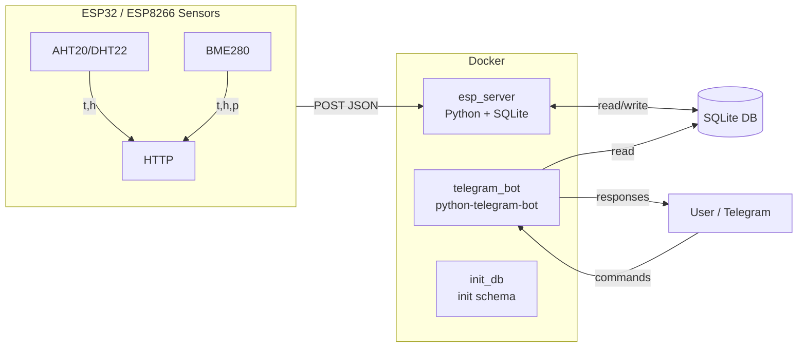

# 🌦 Weather Project

**Weather Project** — это система сбора и анализа данных с микроконтроллеров (ESP32/ESP8266 и совместимых), которая сохраняет показания температуры, влажности и давления в локальную базу данных SQLite и предоставляет быстрый доступ к информации через Telegram-бота.

Проект спроектирован с прицелом на **простоту**, **надёжность** и **прозрачность конфигурации**. Всё разворачивается в Docker-контейнерах и легко запускается даже на минимальном сервере.

---

## Возможности

- Приём данных от ESP-устройств (HTTP POST, JSON).
- Сохранение данных в SQLite с ретеншном (автоматическая очистка старых записей).
- Telegram-бот:
  - текущие показания,
  - значения в прошлом (через `/ago`),
  - тренды (`/trend`),
  - inline-кнопки для выбора сенсора и интервала,
  - кэширование и анти-дребезг.
- Автоматическая инициализация/миграция базы при первом запуске.
- Полностью контейнеризованная архитектура (Docker Compose).
- Настройки через `.env`.

---

## Архитектура



## Структура проекта

```
weather-project/
├── esp_server/        # HTTP сервер для ESP
│   ├── esp_server.py
│   └── Dockerfile.esp
├── telegram_bot/      # Telegram-бот
│   ├── bot.py
│   ├── requirements.txt
│   └── Dockerfile
├── init_db/           # Сервис инициализации базы
│   ├── init_db.py
│   └── Dockerfile
├── data/              # Том с БД и логами (создаётся при запуске)
├── docker-compose.yml
├── .env.example       # Шаблон конфигурации
├── .gitignore
└── README.md
```

## Быстрый старт

1. Клонируем репозиторий

```bash
git clone https://github.com/W1spi/weather-project.git
cd weather-project
```

2. Настраиваем окружение

Создаём файл .env на основе .env.example:

```bash
cp .env.example .env
nano .env
```

Прописываем реальные значения:

```env
BOT_TOKEN=your_telegram_token
TZ=Europe/Moscow
DATA_DIR=/data
DB_FILE=/data/weather.db
```

3. Запускаем

```bash
docker compose up -d --build
```

4. Проверяем

Telegram-бот: пишем /start в чат с ботом.

## Пример API для ESP

ESP32 шлёт POST запросы в http://<server>:8080/ с телом JSON:

```JSON
{
  "t_dht": 22.5,
  "h_dht": 40,
  "t_bme": 22.3,
  "h_bme": 42,
  "pressure": 755,
  "zone": "indoor",
  "source": "esp32-c3"
}
```

Сервер поддерживает алиасы для полей:
Температура: ```t_dht, temperature_dht, t_bme, temperature, temp```
Влажность: ```h_dht, humidity_dht, h_bme, humidity, hum```
Давление: ```pressure, press, p_bme```

## Использование Telegram-бота

Команды

```
/start — справка и меню.
/weather — текущие показания.
/ago <минуты> [sensor] — значения N минут назад.
/trend [минуты] [sensor] — тренд (по умолчанию 30 минут).
/debug — краткая диагностика БД.
/dbdiag — путь и статистика БД.
```

Inline-кнопки

Переключение сенсоров: BME280 / DHT22.
Быстрый выбор интервала: Сейчас, 30 мин, 1 час, 2 часа.
Тренд: Δ 30 мин.

## Переменные окружения

| Переменная             | Описание                             | По умолчанию       |
| ---------------------- | ------------------------------------ | ------------------ |
| `BOT_TOKEN`            | Telegram Bot API токен               | —                  |
| `DB_FILE`              | путь к SQLite БД                     | `/data/weather.db` |
| `DATA_DIR`             | каталог данных                       | `/data`            |
| `TZ`                   | часовой пояс (IANA)                  | `Europe/Moscow`    |
| `RETENTION_DAYS`       | сколько дней хранить данные          | `90`               |
| `LOG_FILE`             | путь для JSONL-логов (опция)         | пусто              |
| `JSONL_ROTATE_MONTHLY` | резать JSONL по месяцам (true/false) | `false`            |

## Дальнейшие планы

Добавить поддержку Grafana/Prometheus для визуализации.
Расширить ESP-протокол (поддержка CO₂ и др. датчиков).
Сделать миграции схемы через alembic или встроенный механизм.
CI/CD (GitHub Actions → автосборка образов).

## Вклад

Pull Request’ы и Issues приветствуются!
Проект изначально разрабатывался как pet-project для домашнего сервера, но может быть полезен и другим.

## Лицензия

MIT License. Используйте, модифицируйте и делитесь свободно.
